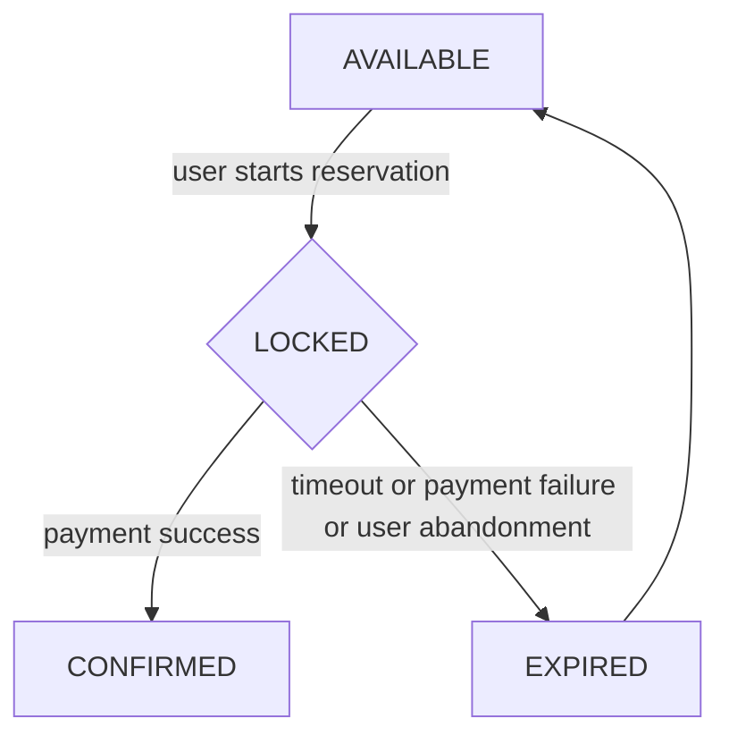

# Reserix

High-Concurrency Reservation Engine designed to handle flash-sale level traffic with strict consistency guarantees.

---

## 🚀 Overview

Reserix is a distributed reservation system built to solve one critical problem:

> Prevent double-booking under extreme concurrent load.

The system is designed to handle thousands of simultaneous reservation requests while ensuring data consistency and real-time seat availability.

---

## ⚡ Key Highlights

- Handles **10K+ concurrent users**
- Guarantees **zero double-booking**
- Uses **distributed locking (Redis)** for concurrency control
- Implements **queue-based reservation processing**
- Real-time seat availability with caching
- Fault-tolerant design with retry & idempotency

---

## 🧠 Core Problem

In high-traffic scenarios (e.g. ticket sales, flash events):

- Multiple users attempt to reserve the same seat
- Race conditions lead to **double booking**
- System inconsistency causes financial and UX issues

Reserix addresses this using a combination of:

- Distributed locking
- Controlled request queuing
- Strong consistency guarantees

---

## 🏗️ Architecture

> (Add diagram here)

Core components:

- API Server (Kotlin + Spring Boot)
- Redis (Locking & caching)
- PostgreSQL (source of truth)
- Queue system (reservation ordering)

---

## 🔄 Reservation Flow

- Seats are temporarily locked during reservation
- Expired locks are automatically released
- Final confirmation ensures consistency

---

## 📊 Performance Goals

- Throughput: **5,000 ~ 20,000 req/sec**
- Latency: **p95 < 200ms**
- Consistency: **No double booking**

---

## 🧪 Load Testing

> (Add k6 / Locust results here)

- Simulated 10K+ concurrent users
- Verified zero race condition issues
- Measured latency and throughput under stress

---

## 🛠️ Tech Stack

- **Backend:** Java, Spring Boot
- **Database:** PostgreSQL
- **Cache/Lock:** Redis
- **Infra:** Docker, AWS
- **Load Test:** k6 / Locust

---

## 🎯 Why This Project

This project focuses on **real-world distributed system challenges**:

- Concurrency control
- Data consistency
- High-load system behavior
- Failure handling

---

## 📌 Status

🚧 In Progress – Building core reservation engine and concurrency handling
