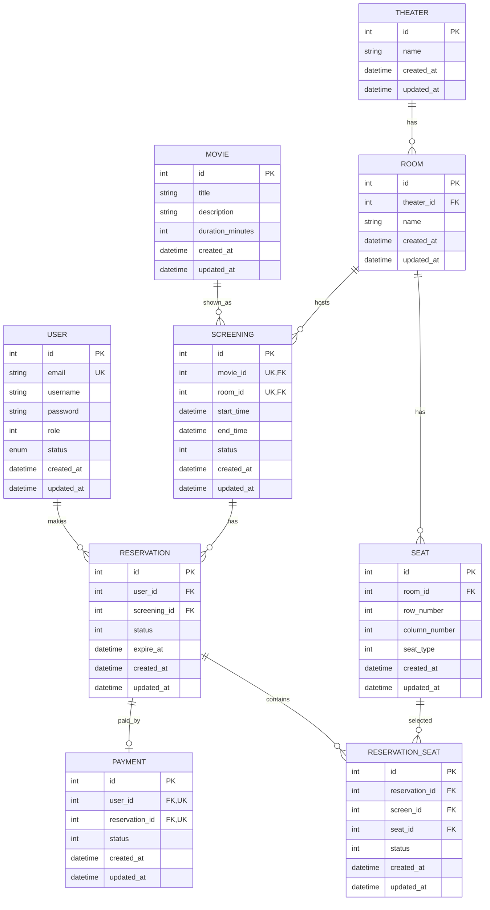

# Database overview

## Database Entity Flow

```mermaid
erDiagram
    USER {
        int id PK
        string email UK
        string username
        string password
        int role
        enum status
        datetime created_at
        datetime updated_at
    }

    MOVIE {
        int id PK
        string title 
        string description
        int duration_minutes
        datetime created_at
        datetime updated_at
    }

    THEATER {
        int id PK
        string name
        datetime created_at
        datetime updated_at
    }

    ROOM {
        int id PK
        int theater_id FK
        string name
        datetime created_at
        datetime updated_at
    }

    SEAT {
        int id PK
        int room_id FK 
        int row_number
        int column_number
        int seat_type
        datetime created_at
        datetime updated_at
    }
  
    SCREENING {
        int id PK
        int movie_id UK, FK
        int room_id UK, FK
        datetime start_time
        datetime end_time
        int status
        datetime created_at
        datetime updated_at
    }
    
    RESERVATION {
        int id PK
        int user_id FK
        int screening_id FK
        int status
        datetime expire_at
        datetime created_at
        datetime updated_at
    }

    RESERVATION_SEAT {
        int id PK
        int reservation_id FK
        int screen_id FK
        int seat_id FK
        int status
        datetime created_at
        datetime updated_at
    }

    PAYMENT {
        int id PK
        int user_id FK, UK
        int reservation_id FK, UK
        int status
        datetime created_at
        datetime updated_at
    }

    THEATER ||--o{ ROOM : has
    ROOM ||--o{ SEAT : has
    ROOM ||--o{ SCREENING : hosts
    MOVIE ||--o{ SCREENING : shown_as

    USER ||--o{ RESERVATION : makes
    SCREENING ||--o{ RESERVATION : has
    RESERVATION ||--o{ RESERVATION_SEAT : contains
    SEAT ||--o{ RESERVATION_SEAT : selected

    RESERVATION ||--o| PAYMENT : paid_by
```