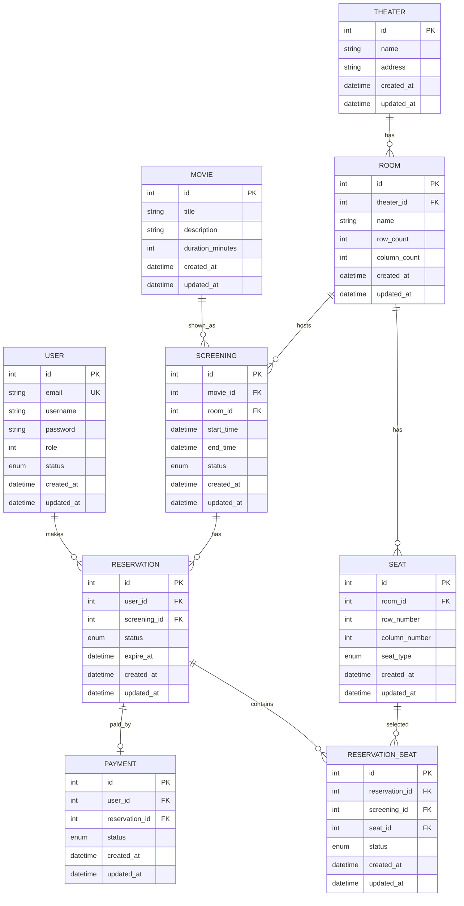

# Database overview

## Database Entity Flow

## Constraints
- USER UNIQUE(email)
- SEAT UNIQUE(room_id, row_number, column_number)
- RESERVATION UNIQUE(id, screening_id)
- RESERVATION_SEAT UNIQUE(screening_id, seat_id)
- RESERVATION_SEAT FK(reservation_id, screening_id) → RESERVATION(id, screening_id)
- PAYMENT UNIQUE(reservation_id)
- ROOM UNIQUE(theater_id, name)
- THEATER UNIQUE(address, name)
- SCREENING UNIQUE(room_id, start_time)
- SCREENING must not overlap in same room

